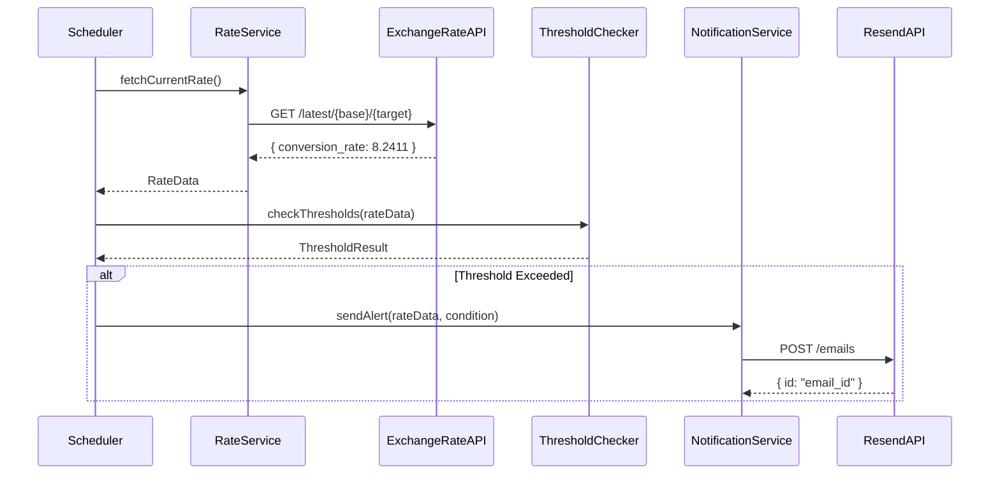

# Design Document

## Overview

汇率监控系统是一个基于 Node.js + TypeScript 的后台服务，采用模块化架构设计。系统通过定时任务定期调用 ExchangeRate-API 获取汇率数据，根据预设阈值条件判断是否需要发送邮件通知，并通过 Resend 服务完成邮件发送。

核心设计原则：
- **单一职责**：每个模块负责单一功能
- **依赖注入**：便于测试和组件替换
- **配置驱动**：所有可变参数通过配置管理
- **可扩展性**：架构支持未来添加多货币对和 REST API

## Architecture

系统采用分层架构，主要包含以下层次：

```
┌─────────────────────────────────────┐
│         Application Layer           │
│    (Scheduler & Orchestration)      │
└──────────────┬──────────────────────┘
               │
┌──────────────┴──────────────────────┐
│         Service Layer               │
│  ┌──────────┐  ┌─────────────────┐ │
│  │  Rate    │  │  Notification   │ │
│  │ Service  │  │    Service      │ │
│  └──────────┘  └─────────────────┘ │
└──────────────┬──────────────────────┘
               │
┌──────────────┴──────────────────────┐
│      Infrastructure Layer           │
│  ┌──────────┐  ┌─────────────────┐ │
│  │   HTTP   │  │     Email       │ │
│  │  Client  │  │    Client       │ │
│  └──────────┘  └─────────────────┘ │
└──────────────┬──────────────────────┘
               │
┌──────────────┴──────────────────────┐
│         Configuration Layer         │
│      (Environment Variables)        │
└─────────────────────────────────────┘
```

### 组件交互流程



## Components and Interfaces

### 1. Configuration Module

负责加载和验证所有配置参数。

```typescript
interface AppConfig {
  exchangeRate: {
    apiUrl: string;
    baseCurrency: string;
    targetCurrency: string;
  };
  thresholds: {
    upper: number;
    lower: number;
  };
  polling: {
    intervalHours: number;
  };
  notification: {
    resendApiKey: string;
    fromEmail: string;
    toEmail: string;
    cooldownMinutes: number;
  };
  logging: {
    level: 'info' | 'warning' | 'error';
  };
}

class ConfigService {
  load(): AppConfig;
  validate(config: AppConfig): void;
}
```

**实现细节：**
- 使用 `dotenv` 加载 `.env` 文件
- 启动时验证所有必需参数
- 缺少参数时抛出描述性错误

### 2. Rate Service

负责从 ExchangeRate-API 获取汇率数据。

```typescript
interface RateData {
  baseCurrency: string;
  targetCurrency: string;
  conversionRate: number;
  timestamp: Date;
  source: string;
}

interface ExchangeRateApiResponse {
  result: string;
  base_code: string;
  target_code: string;
  conversion_rate: number;
  time_last_update_unix: number;
}

class RateService {
  constructor(private httpClient: HttpClient, private config: AppConfig);
  
  async fetchCurrentRate(): Promise<RateData>;
  private parseApiResponse(response: ExchangeRateApiResponse): RateData;
}
```

**实现细节：**
- 使用 `axios` 进行 HTTP 请求
- 请求失败时记录错误并返回 null
- 设置合理的超时时间（10秒）
- 提取 `conversion_rate` 字段

### 3. Threshold Checker

负责判断汇率是否触发通知条件。

```typescript
interface ThresholdResult {
  shouldNotify: boolean;
  condition?: 'above_upper' | 'below_lower';
  message?: string;
}

class ThresholdChecker {
  constructor(private config: AppConfig);
  
  check(rateData: RateData): ThresholdResult;
  private formatMessage(rateData: RateData, condition: string): string;
}
```

**实现细节：**
- 比较当前汇率与配置的上下阈值
- 生成描述性通知消息
- 返回结构化的检查结果

### 4. Notification Service

负责发送邮件通知并管理通知冷却期。

```typescript
interface EmailContent {
  subject: string;
  htmlBody: string;
  textBody: string;
}

class NotificationService {
  constructor(
    private emailClient: EmailClient,
    private config: AppConfig,
    private notificationCache: NotificationCache
  );
  
  async sendAlert(rateData: RateData, condition: string): Promise<void>;
  private shouldSendNotification(condition: string): boolean;
  private buildEmailContent(rateData: RateData, condition: string): EmailContent;
  private async sendWithRetry(content: EmailContent): Promise<void>;
}
```

**实现细节：**
- 使用 Resend SDK 发送邮件
- 实现 1 小时冷却期防止重复通知
- 失败后等待 5 分钟重试一次
- 邮件内容包含汇率、时间戳、货币对信息

### 5. Notification Cache

管理通知冷却期状态。

```typescript
interface NotificationRecord {
  condition: string;
  timestamp: Date;
}

class NotificationCache {
  private cache: Map<string, NotificationRecord>;
  
  canSend(condition: string, cooldownMinutes: number): boolean;
  record(condition: string): void;
  cleanup(): void;
}
```

**实现细节：**
- 使用内存 Map 存储最近通知记录
- 定期清理过期记录
- 按条件类型（above_upper/below_lower）分别管理

### 6. Scheduler

负责定时任务调度和流程编排。

```typescript
class Scheduler {
  constructor(
    private rateService: RateService,
    private thresholdChecker: ThresholdChecker,
    private notificationService: NotificationService,
    private config: AppConfig,
    private logger: Logger
  );
  
  start(): void;
  stop(): void;
  private async executeCheck(): Promise<void>;
}
```

**实现细节：**
- 使用 `node-cron` 实现定时任务
- 启动时立即执行一次检查
- 根据配置的间隔时间调度后续检查
- 协调各服务完成完整的检查流程

### 7. Logger

提供统一的日志记录功能。

```typescript
class Logger {
  constructor(private level: string);
  
  info(message: string, meta?: object): void;
  warning(message: string, meta?: object): void;
  error(message: string, error?: Error, meta?: object): void;
}
```

**实现细节：**
- 使用 `winston` 或简单的 console 输出
- 支持结构化日志（JSON 格式）
- 根据配置的日志级别过滤输出
- 敏感信息（API key）不记录到日志

## Data Models

### Environment Variables

```bash
# ExchangeRate API Configuration
EXCHANGE_API_URL=https://v6.exchangerate-api.com/v6/{api_key}/pair
EXCHANGE_API_KEY=your_api_key_here
BASE_CURRENCY=EUR
TARGET_CURRENCY=CNY

# Threshold Configuration
RATE_UPPER_THRESHOLD=8.5
RATE_LOWER_THRESHOLD=8.0

# Polling Configuration
POLLING_INTERVAL_HOURS=2

# Resend Configuration
RESEND_API_KEY=re_your_api_key
FROM_EMAIL=alerts@yourdomain.com
TO_EMAIL=admin@example.com
NOTIFICATION_COOLDOWN_MINUTES=60

# Logging Configuration
LOG_LEVEL=info
```

### Email Template

```html
<!DOCTYPE html>
<html>
<head>
  <style>
    body { font-family: Arial, sans-serif; }
    .alert { padding: 20px; background-color: #f8f9fa; }
    .rate { font-size: 24px; font-weight: bold; color: #007bff; }
  </style>
</head>
<body>
  <div class="alert">
    <h2>汇率提醒</h2>
    <p>货币对：<strong>{{baseCurrency}}/{{targetCurrency}}</strong></p>
    <p>当前汇率：<span class="rate">{{conversionRate}}</span></p>
    <p>触发条件：{{condition}}</p>
    <p>时间：{{timestamp}}</p>
  </div>
</body>
</html>
```

## Error Handling

### 1. API 请求失败

**场景：** ExchangeRate-API 请求超时或返回错误

**处理策略：**
- 捕获异常并记录详细错误信息
- 不中断系统运行，等待下次调度
- 如果连续失败超过 3 次，记录警告日志

### 2. 邮件发送失败

**场景：** Resend API 调用失败

**处理策略：**
- 记录失败详情
- 等待 5 分钟后重试一次
- 重试仍失败则放弃，记录错误日志
- 不影响后续的汇率检查

### 3. 配置错误

**场景：** 缺少必需的环境变量或配置值无效

**处理策略：**
- 启动时验证所有配置
- 发现错误立即终止启动
- 输出清晰的错误消息指明缺少的参数

### 4. 数据解析错误

**场景：** API 返回的数据格式不符合预期

**处理策略：**
- 验证响应结构和必需字段
- 解析失败时记录原始响应数据
- 跳过本次检查，等待下次调度

## Testing Strategy

### 1. Unit Tests

**测试范围：**
- ConfigService: 配置加载和验证逻辑
- ThresholdChecker: 阈值判断逻辑
- NotificationCache: 冷却期管理逻辑
- Email template rendering

**测试工具：** Jest

**Mock 策略：**
- Mock 外部 API 调用
- Mock 时间相关函数（Date.now）

### 2. Integration Tests

**测试范围：**
- RateService 与 ExchangeRate-API 的集成
- NotificationService 与 Resend API 的集成
- 完整的检查流程（端到端）

**测试环境：**
- 使用测试环境的 API keys
- 发送邮件到测试邮箱

### 3. Error Scenario Tests

**测试场景：**
- API 超时和网络错误
- 无效的 API 响应
- 邮件发送失败和重试
- 缺少配置参数

## Future Extensibility

### 1. 多货币对支持

**设计考虑：**
- 将当前单一货币对配置改为数组
- 为每个货币对独立管理通知状态
- Scheduler 循环处理所有配置的货币对

**所需修改：**
```typescript
interface CurrencyPairConfig {
  id: string;
  baseCurrency: string;
  targetCurrency: string;
  upperThreshold: number;
  lowerThreshold: number;
}

interface AppConfig {
  currencyPairs: CurrencyPairConfig[];
  // ... other config
}
```

### 2. REST API 接口

**设计考虑：**
- 添加 Express.js 服务器
- 提供 CRUD 接口管理货币对配置
- 提供查询当前汇率和历史通知的接口

**端点设计：**
```
GET    /api/rates/current          # 获取当前所有汇率
GET    /api/pairs                  # 获取配置的货币对列表
POST   /api/pairs                  # 添加新货币对
PUT    /api/pairs/:id              # 更新货币对配置
DELETE /api/pairs/:id              # 删除货币对
GET    /api/notifications/history  # 获取通知历史
```

### 3. 数据持久化

**设计考虑：**
- 引入数据库（SQLite/PostgreSQL）存储配置和历史数据
- 保存汇率历史记录用于趋势分析
- 持久化通知记录

**数据模型：**
- `currency_pairs` 表：存储货币对配置
- `rate_history` 表：存储历史汇率数据
- `notifications` 表：存储通知记录

## Deployment Considerations

### 运行方式

**开发环境：**
```bash
npm run dev  # 使用 ts-node 直接运行
```

**生产环境：**
```bash
npm run build  # 编译 TypeScript
npm start      # 运行编译后的 JavaScript
```

### 进程管理

推荐使用 PM2 管理进程：
```bash
pm2 start dist/index.js --name currency-monitor
pm2 save
pm2 startup
```

### 容器化（可选）

提供 Dockerfile 支持容器部署：
```dockerfile
FROM node:18-alpine
WORKDIR /app
COPY package*.json ./
RUN npm ci --only=production
COPY dist ./dist
CMD ["node", "dist/index.js"]
```

## Dependencies

### Core Dependencies
- `typescript`: ^5.0.0
- `node-cron`: ^3.0.0
- `axios`: ^1.6.0
- `resend`: ^3.0.0
- `dotenv`: ^16.0.0

### Development Dependencies
- `@types/node`: ^20.0.0
- `@types/node-cron`: ^3.0.0
- `ts-node`: ^10.9.0
- `jest`: ^29.0.0
- `@types/jest`: ^29.0.0

### Optional Dependencies
- `winston`: ^3.11.0 (for advanced logging)
- `express`: ^4.18.0 (for future REST API)
